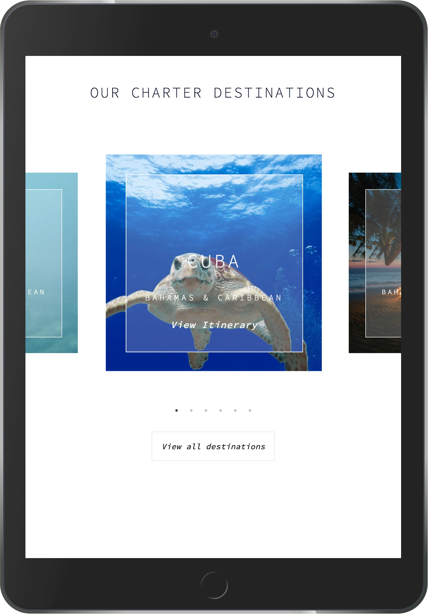

# Responsive Carousel

## Overview
I was tasked to build a content carousel module that is fully responsive and matches the supplied sketch designs. This was a front-end code test consisting of 2 parts – mark-up and styling of an HTML template and implementation of an interactive JavaScript component within it.

## Technical Requirements (For MVP)
1. The site should be AA compliant against the WCAG 2.0 Accessibility guidelines.
2. It needs to use valid HTML5 and make use of a CSS pre-processor (SASS/LESS).
3. It should be platform agnostic and work well across all screen-sizes - designs are provided for
all breakpoints.
4. Navigating left or right should trigger the correct element to move into the central position.
5. JavaScript frameworks can be used for this component (such as React, AngularJS etc) as well.

## Technologies Used
- React (Front-end)
- Yarn package manager
- React Slick
- Slick Carousel
- SCSS

## How to use
1. Clone the git repository

```
git clone git@github.com:noopsyjoshi/react-carousel.git
```

2. Open the Terminal, browse to the cloned repo folder and run the following command:

```
yarn
```

This will add the dependencies in the package.json file.

3. Run the following command to open the application in the browser:

```
yarn start:client
```

4. For the styling to apply, move into the 'style' directory and run:

```
sass --watch style.scss:output.css
```

## Wireframes
The sketch designs were provided to me. My task was to convert the designs into a fully responsive working webpage.

1. Mobile design


2. Tablet design


3. Desktop design


## Output
1. The carousel on tablet



2. The carousel on desktop


3. The carousel on mobile


## Approach Taken
1. I created a simple React front-end which displays 'Hello World' in the browser.
2. I added the HTML elements to match the content on the designs; the header, the images and text on the carousel, the 'view all destinations' link at the bottom of the page.
3. I added the 'React-Slick' and 'Slick-Carousel' dependencies using Yarn
4. I created a 'Carousel' React component and created the slides
5. I used CSS to style the webpage, and then converted into SCSS.

## Wins
- I styled the webpage using CSS to begin with as I felt more comfortable with the technology. I was pleased with how quickly I was able to style the page with SCSS afterwards.
- I was able to get the carousel to look like the original designs which were provided to me. Moreover, the carousel works in Safari, Mozilla and Chrome.

## Challenges
- A big challenge was to get the carousel mobile and tablet responsive. This was because the images in the carousel were overlapping one another when the screen was resized. To fix this I added responsive breakpoints as part of the settings object in the carousel component and media queries.
- Another challenge was to get the previous and next arrows surrounding the central image in the carousel. I used dots instead of arrows as a workaround.
